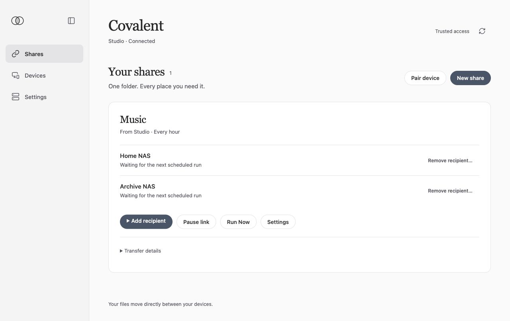

# Covalent

**One-way file transfers between your own devices.**

Covalent pairs your devices, copies a source folder to one or more destinations,
and shows transfer status. Use it to send phone photos to a server, copy a Mac
folder to another device, or collect each family member's files in separate
folders. Destination copies remain ordinary files you can open with other apps.
No hosted account or subscription is required.



Covalent uses rclone for file transfers, with native macOS and Android apps and
a web console for Docker and Unraid. It manages pairing, folder permissions,
shared settings, and transfer timing around that engine.

## Get started

The current published release is **[v0.2.1](https://github.com/thekozugroup/Covalent/releases/tag/v0.2.1)**.
Download packages and their checksums from that release, then follow your
platform's installation guide:

| Platform | Installation | Availability |
| --- | --- | --- |
| macOS 15 or later, Apple Silicon | [Mac setup](docs/platform/macos.md) | Personal-use app; ad-hoc signed and not notarized. |
| Android | [Android setup](docs/platform/android.md) | Debug-signed personal APK; release testing uses Android 17 / API 37 on an emulator. |
| Unraid | [Unraid setup](docs/platform/unraid.md) | Docker template; Community Applications listing is not yet available. |
| Other Docker hosts | [Docker setup](packaging/docker/README.md#release-installation) | Linux `amd64` and `arm64` images. |

These are early, pre-1.0 personal-use packages. Mac installation may require a
one-time Gatekeeper exception after verification; never disable Gatekeeper
globally. Android production signing and physical-phone validation remain
outstanding. The Android manifest allows API 26 and later, but older versions
are not release-tested. Intel Macs, iOS, and Windows have no supported client.
Do not use the historical v0.1.0 packages for a current installation.

After installation, **[Create your first one-way link](docs/getting-started-links.md)**:

1. Pair two devices and confirm that their displayed codes match.
2. Choose a source folder, destination device, and transfer timing. Review the
   deletion choices before confirming.
3. On the receiving device, choose its destination folder and accept the link.
4. Use **Run Now** with a small test folder. Add more destinations when ready.

Server installation needs an explicitly provisioned encryption key and HTTPS
for network management. Follow the Docker guide and, when needed, the
[verified CLI install guide](docs/release/cli-install.md). Keep server keys and
access tokens private; do not use a curl-pipe-shell installer or bypass TLS.

## How links behave

Each link has one source and one or more destinations. File content travels
from the source to its destinations. Destination changes never modify the
source or another destination. An offline destination does not stop the others.
For a shared collection, give each contributor a separate child folder;
Covalent rejects overlapping link roots.

Choose **Manual**, **Scheduled**, or **Continuous** transfers. Continuous mode
checks for changes periodically. Shared settings apply across the link, and
the source confirms changes proposed by its authorized members. Android can
wait for Wi-Fi or charging; operating-system background limits can delay work.
Schedules do not guarantee exact delivery times.

The two deletion choices are independent and **off by default**:

- **Delete destination copies when source files are deleted:** leave it off to
  retain those copies. Turn it on only if source deletion should also delete
  copies made by the link.
- **Restore files deleted at the destination:** leave it off to keep a
  destination deletion in place. Turn it on to copy the file again on the next
  run, if it still exists at the source.

Removing a link stops transfers and keeps existing files. One-way links do not
provide bidirectional editing or historical file versions. Keep an independent
backup of important data. For live databases or server appdata, use a stopped
application or a consistent snapshot as the source; ordinary file copying is
not a guaranteed live-database backup.

## Documentation and support

- [First link and deletion settings](docs/getting-started-links.md)
- [Website content pack](docs/website/HANDOFF.md)
- [Troubleshooting](docs/troubleshooting.md)
- [Product scope](docs/product/requirements.md) and [release evidence](docs/release/completion-progress.md)
- [Legacy encrypted backup setup](docs/getting-started.md), for existing backup data

For bugs or setup questions, use [GitHub Issues](https://github.com/thekozugroup/Covalent/issues).
For suspected vulnerabilities, follow [SECURITY.md](SECURITY.md) and report
privately. Covalent has not completed an external cryptographic audit. See the
[threat model](docs/security/threat-model.md) for assumptions and limits.

## Contribute

Start with [CONTRIBUTING.md](CONTRIBUTING.md). For shared Rust code:

```sh
./scripts/bootstrap.sh core
./scripts/check.sh core
cargo run -p covalent-cli -- doctor
```

Bootstrap checks prerequisites; it does not start a node. Platform build
instructions live in the [Apple](apps/apple/README.md),
[Android](apps/android/README.md), and [Docker](packaging/docker/README.md) guides.
The shared service and CLI live under `crates/`; native clients under `apps/`;
distribution files under `packaging/`; and specifications under `docs/`.

## License

Covalent is [MIT licensed](LICENSE). Bundled dependencies retain their own
licenses and release notices.
