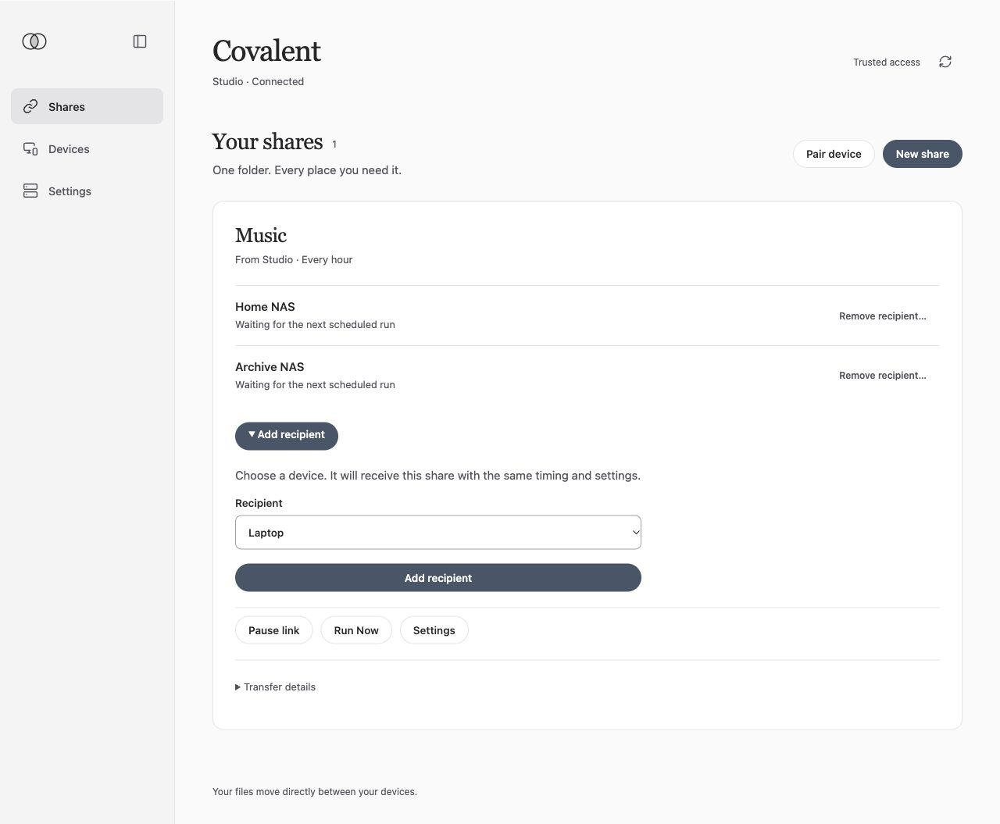

<div align="center">

<picture>
  <source media="(prefers-color-scheme: dark)" srcset="docs/website/brand/covalent-mark-light.svg">
  
</picture>

# Covalent

**Share a folder. Choose where it goes.**

Simple, self-hosted file sharing powered by rclone. One source, one or more
recipients, and the same settings on every device.

[](https://github.com/thekozugroup/Covalent/releases/latest)
[](LICENSE)

[Quick start](#quick-start) · [What it looks like](#what-it-looks-like) ·
[What it does](#what-it-does) · [Platforms](#platforms) ·
[Development](#development) · [Documentation](#documentation)

</div>

---

## Why

Copying a folder to another device should not require a lesson in sync engines.
Covalent grew out of frustration with the number of settings and decisions
between choosing a folder and knowing where its files will go.

Tools such as Syncthing and Resilio Sync offer controls that are useful for
more involved setups. For a one-way copy to a few devices, I wanted fewer
decisions and a clearer view of the source, recipients, and deletion behavior.

Covalent uses rclone for the transfers and provides the pairing, folder selection,
shared settings, and status around it. It deliberately offers less configuration
than a general-purpose sync tool. Destination copies are ordinary files you can
open with other apps. No hosted Covalent account or subscription is required.

## Quick start

1. **Install on two devices.** Get the packages and checksums from
   [GitHub Releases](https://github.com/thekozugroup/Covalent/releases/latest),
   or follow the [Docker][docker-setup] or [Unraid][unraid-setup] guide.
2. **Pair the devices.** Compare the confirmation code on both ends.
3. **Create a share.** Choose a source folder, a recipient, transfer timing,
   and deletion choices. The recipient accepts and selects its destination folder.
4. **Run a small first transfer.** Use **Run Now**, then add other recipients
   to that same share when ready.

Start with [Create your first one-way link][first-link]. Pairing alone shares
no files; the receiving device must accept each share.

The current public native packages are **v0.2.1**, for personal use. The Mac app
is ad-hoc signed and not notarized; the Android APK is debug-signed. Follow the
platform guide to verify and install the correct package. Newer draft releases
are not public downloads.

<details>
<summary>Installing on a server</summary>

The Docker image includes the web console and supports Linux `amd64` and
`arm64`. The [Docker guide][docker-setup] covers the published image, persistent
state, mounted folders, the separate encryption-key file, and HTTPS management.
The [Unraid guide][unraid-setup] uses the same container with an importable template.

Mount only the folders you want Covalent to access. Keep keys and access tokens
private, and use HTTPS for network management. Automatic image updates are
documented in the Docker guide; keep persistent state and source/destination
mounts intact when updating.

</details>

## What it looks like

One Music share, sent from Studio to two recipients. The source, timing, and
each destination are visible together.


Add another paired recipient to the existing share. It inherits the same timing
and deletion settings; its owner chooses where the files belong.



*Current server interface with example devices and data. These are web-console
captures; native apps have their own interfaces. The pictured console is newer
than the v0.2.1 native packages.*

## What it does

### One source, several recipients

Send phone photos to a server, copy a Mac folder to a NAS, or keep a music
library on several devices. File changes travel from the source to recipients.
Recipient edits do not flow back to the source or across to other recipients.
An offline recipient does not stop transfers to the others.

Recipients see the same share name, source, and recipient list. For a family
collection, give each contributor a separate child folder. They contribute their
own files without receiving everyone else's; overlapping link roots are rejected.

### Settings that belong to the share

Choose **Manual**, **Scheduled**, or **Continuous** transfers. Authorized members
can propose settings changes from either end; the source confirms and distributes
them. Timing and deletion choices apply to the whole share, and pending changes
remain visible.

Continuous mode checks for changes periodically. Android can wait for Wi-Fi or
charging, subject to operating-system background limits. A schedule is not a
guaranteed delivery deadline.

### Deletion choices you can explain

Both options are **off by default** and work independently.

| Choice | Off by default | When enabled |
| --- | --- | --- |
| Delete destination copies when source files are deleted | Keep the destination copies. | Remove copies made by that share after the source files are deleted. |
| Restore files deleted at a destination | Keep that destination deletion in place. | Copy the files again on a later run if they still exist at the source. |

Removing a share stops transfers and keeps the existing files. Missing mounts,
lost permissions, and incomplete scans are not treated as source deletions.
Read the [link behavior and safety guide][link-behavior] before enabling deletion.

## Platforms

| Platform | Interface | Install |
| --- | --- | --- |
| Apple Silicon Mac · macOS 15+ | Native app and menu bar | [macOS guide][mac-setup] |
| Android | Native app and system folder picker | [Android guide][android-setup] |
| Unraid | Docker web console | [Unraid guide][unraid-setup] |
| Linux Docker · amd64 / arm64 | Responsive web console | [Docker guide][docker-setup] |

Android release evidence uses an Android 17 / API 37 emulator. The manifest
allows API 26+, but older versions and physical phones are not release-tested.
Unraid has an importable template; a Community Applications listing is not yet
available. Intel Mac, iOS, and Windows clients are unsupported.

macOS, Android, Docker, and Unraid are the Tier 1 release targets.
iOS is not supported; any retained iOS diagnostics are informational,
not a required check.

## Deliberate limits

Covalent focuses on one-way file sharing. It does not provide two-way
collaborative editing, content deduplication, or historical backup versions.
Renamed files can coexist, and retaining source-deleted files can keep old copies.
It is not a duplicate cleaner.

Keep independent backups of important files. For live databases or server
appdata, use a consistent snapshot or stop the application before copying.
Ordinary file copying is not a guaranteed live-database backup. See the
[security model][security-model] for trust boundaries and limitations; the
project has not completed an external cryptographic audit.

## Development

Current rclone development is on
[`codex/production-readiness`](https://github.com/thekozugroup/Covalent/tree/codex/production-readiness)
in [PR #32](https://github.com/thekozugroup/Covalent/pull/32). Use that branch
for the implementation described here; the default branch's source is older.

```sh
git clone --branch codex/production-readiness https://github.com/thekozugroup/Covalent.git
cd Covalent
./scripts/bootstrap.sh core
./scripts/check.sh core
```

Bootstrap checks prerequisites; it does not start a node. See
[CONTRIBUTING.md](CONTRIBUTING.md) for targeted checks and contribution scope.
The [Apple][apple-dev], [Android][android-dev], and [Docker][docker-setup] guides
cover platform builds. Use the bundled rclone engine; keep transfer behavior and
data-safety rules in the shared implementation.

| Directory | Purpose |
| --- | --- |
| `crates/` | Shared Rust service, protocol, transfer coordination, and CLI |
| `apps/` | Native SwiftUI and Jetpack Compose clients |
| `packaging/` | Docker, Unraid, rclone, and the server web console |
| `docs/` | Setup, architecture, security, release evidence, and website assets |

## Documentation

- [First share][first-link] · [Troubleshooting][troubleshooting]
- [Architecture][architecture] · [Product scope][requirements] · [Design][design]
- [Release notes][release-notes] · [Verification record][release-evidence]
- [Screenshots and website content pack][website-pack]
- [Back up your first folder](docs/getting-started.md), for existing legacy
  encrypted archives only; [current legacy guidance][legacy-backups]

Report reproducible bugs through [GitHub Issues](https://github.com/thekozugroup/Covalent/issues).
For vulnerabilities, follow [SECURITY.md](SECURITY.md) and report privately.

## License

[MIT](LICENSE). Bundled dependencies retain their own licenses and notices.

[first-link]: https://github.com/thekozugroup/Covalent/blob/9088b50416f686d533d75e27b8d89804dab51139/docs/getting-started-links.md
[docker-setup]: https://github.com/thekozugroup/Covalent/blob/9088b50416f686d533d75e27b8d89804dab51139/packaging/docker/README.md
[unraid-setup]: https://github.com/thekozugroup/Covalent/blob/9088b50416f686d533d75e27b8d89804dab51139/docs/platform/unraid.md
[mac-setup]: https://github.com/thekozugroup/Covalent/blob/9088b50416f686d533d75e27b8d89804dab51139/docs/platform/macos.md
[android-setup]: https://github.com/thekozugroup/Covalent/blob/9088b50416f686d533d75e27b8d89804dab51139/docs/platform/android.md
[link-behavior]: https://github.com/thekozugroup/Covalent/blob/9088b50416f686d533d75e27b8d89804dab51139/docs/product/synchronization.md
[security-model]: https://github.com/thekozugroup/Covalent/blob/9088b50416f686d533d75e27b8d89804dab51139/docs/security/threat-model.md
[apple-dev]: https://github.com/thekozugroup/Covalent/blob/9088b50416f686d533d75e27b8d89804dab51139/apps/apple/README.md
[android-dev]: https://github.com/thekozugroup/Covalent/blob/9088b50416f686d533d75e27b8d89804dab51139/apps/android/README.md
[architecture]: https://github.com/thekozugroup/Covalent/blob/9088b50416f686d533d75e27b8d89804dab51139/docs/architecture/overview.md
[requirements]: https://github.com/thekozugroup/Covalent/blob/9088b50416f686d533d75e27b8d89804dab51139/docs/product/requirements.md
[design]: https://github.com/thekozugroup/Covalent/blob/9088b50416f686d533d75e27b8d89804dab51139/DESIGN.md
[troubleshooting]: https://github.com/thekozugroup/Covalent/blob/9088b50416f686d533d75e27b8d89804dab51139/docs/troubleshooting.md
[release-notes]: https://github.com/thekozugroup/Covalent/tree/9088b50416f686d533d75e27b8d89804dab51139/docs/release/notes
[release-evidence]: https://github.com/thekozugroup/Covalent/blob/9088b50416f686d533d75e27b8d89804dab51139/docs/release/completion-progress.md
[website-pack]: https://github.com/thekozugroup/Covalent/blob/9088b50416f686d533d75e27b8d89804dab51139/docs/website/HANDOFF.md
[legacy-backups]: https://github.com/thekozugroup/Covalent/blob/9088b50416f686d533d75e27b8d89804dab51139/docs/getting-started.md
